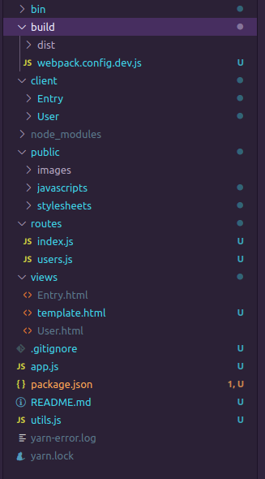
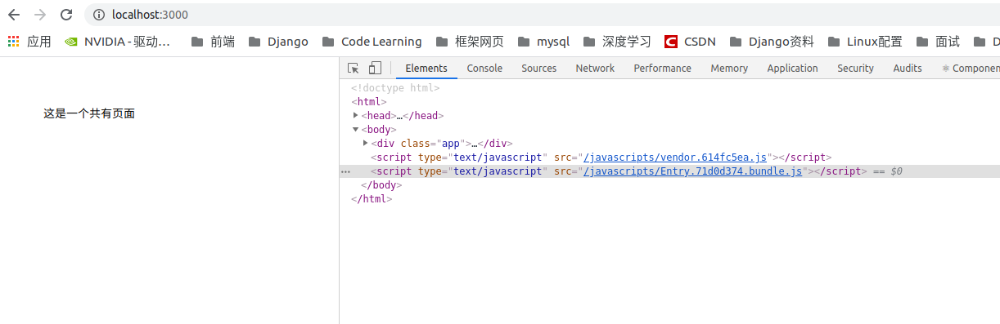
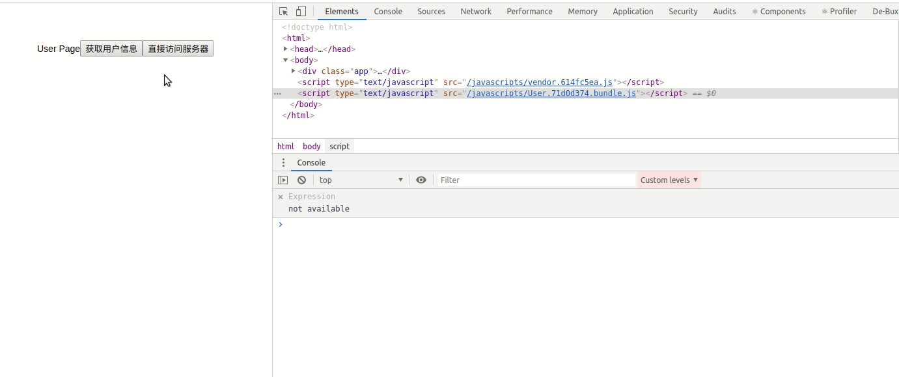

## Koa+React+Webpack环境配置

### 1. 初衷

最近，因疫情在家写了一些东西．想到之前去实习的时候，公司用的Nodejs做中间层，实现数据格式的处理，请求转发，SSR等功能，想自己也折腾下这么个东西，刚好最近或多或少的学了一些Webpack，就从webpack搭一个**Koa作为中间层，页面路由，同时使用React的这么一个脚手架吧**，只是一个自己的玩具吧，哈哈哈哈．

### 2. 使用中间层的作用

我理解的几个nodejs的作用

+ 整合后端接口和接口转发：比如一个功能需要多个不同的接口，可以先把请求打到Node层，通过Node层去访问多个Java接口，之后将多个接口数据进行拼接即可．
+ 解决跨域问题：如果直接使用浏览器发起http请求到后端，会存在跨域问题，使用nodejs获取数据，可以绕过跨域问题(本文进行实践)
+ 利于SEO：利用Node层实现模板渲染功能，有利于SEO(第二部分进行实践)

### 3. 搭建Koa2+React+Webpack开发环境

看了网上一些文章，其实自己对于中间层有点迷糊，这里的想法是**利用Koa的模板渲染功能，在渲染的时候加载打包的React页面的js文件**，通过打包的js文件实现模板渲染react页面(但是不知道这个是怎么实现SSR的)，请教网上各位大佬，谢谢大家了.

因此上述项目的本质上还是一个koa的项目,使用koa2的脚手架搭建一个koa2的后端环境.

#### 1. 项目目录

1. 创建一个build文件夹,在下面创建一个webpack.config.dev.js用于配置webpack的打包配置
2. 创建一个client文件夹,下面主要存放页面
3. routes主要用于koa的路由,api接口和页面的渲染功能
4. views主要是渲染页面的模板
5. public中的javascript主要用于存放打包的页面js,这个publick页面是koa中配置的静态路径的根目录,之后通过页面加载的静态资源文件(打包完毕的js文件都放在这里,之后网页加载的时候通过静态资源进行加载)

#### 2. Webpack环境配置

##### 1. 依赖安装

+ babal相关
  + babel-loader
  + babel-polyfill
  + @babel/core
  + @babel/plugin-transform-runtime
  + @babel/preset-env
  + @babel/preset-react
  + @babel/runtime
  + @babel/runtime-corejs3
+ 其他loader
  + css-loader
  + style-loader
  + file-loader
  + url-loader
+ 其他插件
  + html-webpack-plugin
  + clean-webpack-plugin

##### 2. babel和loader的常规配置

~~~javascript
module: {
    rules: [
        {
            test: /\.jsx?/,
            loader: "babel-loader",
            options: {
                presets: ["@babel/preset-env", "@babel/preset-react"],
                plugins: [
                    [
                        "@babel/plugin-transform-runtime",
                        {
                            corejs: 3
                        }
                    ]
                ]
            },
            exclude: /node_modules/
        },
        {
            test: /\.css/,
            loader: ["style-loader", "css-loader"],
            exclude: /node_modules/
        },
        {
            test: /\.(png|jpg|gif|jpeg|webp|svg|eot|ttf|woff|woff2|ico)$/,
            use: [
                {
                    loader: "url-loader",
                    options: {
                        limit: 10240, //
                        esModule: false
                    }
                }
            ],
            exclude: /node_modules/
        }
    ]
},
~~~

**注意的点: css-loader和style-loader的顺序，执行的时候是倒序出栈执行的，所以要反着配置**

##### 3. 多页面配置

配置考虑如下问题

+ 应该每个页面是多入口的情况，如果要**配置多个入口**
+ 多个入口的文件会引用共有库，例如React，所以在打包的时候应该优化，**分离打包公用包**
+ 使用html-webpack-plugin生成模板页面，通过koa中的ctx.render方法进行渲染，**因此需要配置多生成html文件，仅加载该文件中用到的打包的js文件**

##### 4. 公共包Chunk的打包过程:

这里的name，指定了打包得到的公共包的chunkName这里的vendor,之后在配置html-webpack-plugin的时候按照chunkName进行打包的时候可以配置为vendor

~~~javascript
optimization: {
    splitChunks: {
        cacheGroups: {
            commons: {
                name: "vendor",
                chunks: "all"
            }
        }
    }
}
~~~

##### 5. 多文件入口和html-webpack-plugin配置

这里就是将client下面的目录文件夹配置成对应的页面入口,动态加载多页面和打包html的配置

~~~javascript
const fs = require("fs");

const getEntryDir = () => {
    const dir = fs.readdirSync(path.resolve(__dirname, "../client/"));

    let entry = {};
    let webpackPlugins = [];

    dir.forEach(item => {
        // 配置页面的name和对应的入口路径，完成多页面配置
        entry = {
            ...entry,
            [item]: path.resolve(__dirname, `../client/${item}/index.jsx`)
        };
        // htmlWebpackPlugin的配置需要中使用chunks对对应的HTML页面进行打包即可
        webpackPlugins.push(
            // chunks可以
            new htmlWebpackPlugin({
                template: path.resolve(__dirname, "../views/template.html"),
                filename: path.resolve(__dirname, `../views/${item}.html`),
                chunks: [item, "vendor"]
            })
        );
    });

    return { entry, webpackPlugins };
};
~~~

#### 3. 整体配置

~~~javascript
const config = getEntryDir();

module.exports = {
  mode: "development",
  entry: config.entry,
  output: {
    // 这里的path为打包文件生成的地址，这里要配置到Koa文件的根目录下！！！
    // 这样在加载js的时候才能加载出来，不然会出现找不到静态资源的问题
    path: path.resolve(__dirname, "../public/javascripts/"),
    filename: "[name].[hash:8].bundle.js",
    chunkFilename: "[name].[chunkhash:8].js",
    // 这里配置的是引入打包js的目录，如果配置成/public/javascripts
    // 那么在html-webpack-plugin中引入的js文件路径就为/public/javascripts/a.js
    //　配置为/javascripts/的话　就是/javascripts/a.js
    publicPath: "/javascripts/"
  },
  module: {
    rules: [
      {
        test: /\.jsx?/,
        loader: "babel-loader",
        options: {
          presets: ["@babel/preset-env", "@babel/preset-react"],
          plugins: [
            [
              "@babel/plugin-transform-runtime",
              {
                corejs: 3
              }
            ]
          ]
        },
        exclude: /node_modules/
      },
      {
        test: /\.css/,
        loader: ["style-loader", "css-loader"],
        exclude: /node_modules/
      },
      {
        test: /\.(png|jpg|gif|jpeg|webp|svg|eot|ttf|woff|woff2|ico)$/,
        use: [
          {
            loader: "url-loader",
            options: {
              limit: 10240, //
              esModule: false
            }
          }
        ],
        exclude: /node_modules/
      }
    ]
  },
  resolve: {},
  devtool: "cheap-source-map",
  plugins: [new CleanWebpackPlugin(), ...config.webpackPlugins],
  optimization: {
    splitChunks: {
      cacheGroups: {
        commons: {
          name: "vendor",
          chunks: "all"
        }
      }
    }
  }
};
~~~

#### 4. 配置scripts

~~~json
{
    "scripts": {
        "start": "node bin/www",
        "devBuild": "npx webpack --config ./build/webpack.config.dev.js"
    },
}
~~~

之后用devBuild即可完成打包，使用start启动后端服务即可．

### 4. 测试环境

编写一个Entry下的index.js页面

~~~javascript
// Entry/index.js
import React, { Component } from "react";
import ReactDom from 'react-dom';

export default class App extends Component {
  render() {
    return 
这是一个共有页面
;
  }
}

ReactDom.render(<App />, document.querySelector('.app'))

~~~

Koa配置　(这里就是官方的配置，没啥自己配置的，需要注意的是views的路径)

~~~javascript
const Koa = require('koa')
const app = new Koa()
const views = require('koa-views')
const json = require('koa-json')
const onerror = require('koa-onerror')
const bodyparser = require('koa-bodyparser')
const logger = require('koa-logger')

const index = require('./routes/index')
const users = require('./routes/users')

// error handler
onerror(app)

// middlewares
app.use(bodyparser({
  enableTypes:['json', 'form', 'text']
}))
app.use(json())
app.use(logger())
app.use(require('koa-static')(__dirname + '/public'))

// 这里调用了views中间件后，会向ctx中添加一个render方法，渲染views文件夹下对应的文件
// 如果没有扩展名，会自动补全一个ejs作为文件后缀
app.use(views(__dirname + '/views', {
  extension: 'ejs'
}))

// logger
app.use(async (ctx, next) => {
  const start = new Date()
  await next()
  const ms = new Date() - start
  console.log(`${ctx.method} ${ctx.url} - ${ms}ms`)
})

// routes
app.use(index.routes(), index.allowedMethods())
app.use(users.routes(), users.allowedMethods())

// error-handling
app.on('error', (err, ctx) => {
  console.error('server error', err, ctx)
});

module.exports = app

~~~

Koa路由配置

~~~javascript
router.get("/", async (ctx, next) => {
  await ctx.render("Entry.html");
});
~~~

执行：

~~~bash
yarn devBuild && yarn start
~~~

打开127.0.0.1:3000页面可见到对应效果

### 5. 实现使用node层转发请求

使用node层转发和整合接口以及避免跨域的问题解决方法

+ 页面将请求打到指定的node路由处
+ node层使用http库(request等其他都行)，转发请求到后端服务器
+ 得到数据后返回接口的数据值

##### 1. 编写一个调用本地Django服务的Api接口

~~~react
import ReactDom from "react-dom";
import React, { Component } from "react";
import axios from "axios";

class App extends Component {
    async getUserInfo() {
        const data = await axios.get("/cartList", { params: { userId: 7 } });
        console.log(data);
    }

    async getDirect() {
        const data = await axios.get(
            "http://127.0.0.1:8000/campus/api/getCartList?userId=7&start=1&pageSize=5"
        );
        console.log(data);
    }

    render() {
        return (
            

                User Page
                <button onClick={this.getUserInfo}>获取用户信息</button>
                <button onClick={this.getDirect}>直接访问服务器</button>
            

        );
    }
}

ReactDom.render(<App />, document.querySelector(".app"));
~~~

+ 上面如果是直接调用服务器的话会报非同源的错误
+ 通过nodejs的话就可以避免这个问题

##### 2. node层配置

+ 通过opt配置相应的参数，http.request通过回调函数监听数据返回情况
+ 这个data状态下返回的chunk是一个buffer类型，我们需要将他拼接起来然后转换为json字符串
+ 利用JSON.parse转换为对象返回

~~~javascript
// 定义了一个利用http转发Api的函数getResponse
const http = require("http");
const queryString = require("querystring");

module.exports = {
  getResponse(hostname, port, path, param, success, errFn, processFn) {
    let data = "";

    const query = queryString.stringify(param);

    path += "?" + query;

    const opt = {
      hostname,
      port,
      path,
      method: "GET",
      headers: {
        "Content-Type": "application/json"
      }
    };

    return new Promise((resolve, reject) => {
      const req = http.request(opt, response => {
        response.on("error", err => {
          console.err(err);
          errFn && errFn(err);
          reject(err);
        });

        response.on("end", () => {
          success && success(data);
          resolve(JSON.parse(data));
        });

        response.on("data", chunk => {
          processFn && processFn(chunk.toString(), data);
          data += chunk.toString();
        });
      });

      req.end();
    });
  }
};

~~~

接收到参数返回给前端的逻辑

~~~javascript
const router = require("koa-router")();
const { getResponse } = require("../utils.js");

router.get("/user", async (ctx, next) => {
    await ctx.render("User.html");
});

router.get("/cartList", async ctx => {
    const { userId } = ctx.query;

    const content = { userId, start: 1, pageSize: 5 };

    const data = await getResponse(
        "127.0.0.1",
        8000,
        "/campus/api/getCartList",
        content
    );

    ctx.body = data;
});

router.get("/", async (ctx, next) => {
    await ctx.render("Entry.html");
});

module.exports = router;
~~~

### ６. 效果

